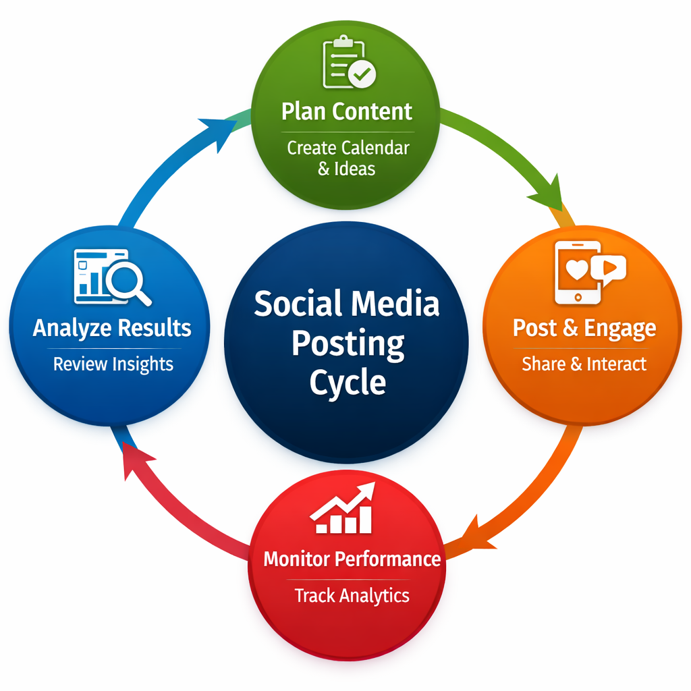

# Social Media Strategy 📊

## Overview
This repository contains a 30-day social media content calendar designed for Instagram, LinkedIn, and Twitter.  
It helps streamline posting schedules, track engagement, and maintain consistent branding.

---

## Features
- ✅ Ready-to-use Excel calendar (`calendar.xlsx`)
- ✅ Structured posting plan for 3 platforms
- ✅ Easy customization for campaigns or themes
- ✅ Clear separation of content types (educational, promotional, engagement-driven)

---

## How to Use
1. Download or open the `calendar.xlsx` file.
2. Review the daily post ideas and adapt them to your brand.
3. Track performance by adding engagement metrics (likes, shares, comments).
4. Update the calendar regularly to reflect new campaigns.

---

## Posting Cycle Diagram

---

## Usage Example
Example: A brand can adapt the calendar to launch a new product campaign by aligning promotional posts with engagement-driven content.

---

## Example Content Types
- 🎓 Educational posts (tips, insights, industry knowledge)
- 📢 Promotional posts (offers, product launches, events)
- 💬 Engagement posts (polls, questions, interactive content)

---

## Contributing
If you’d like to improve or expand this calendar:
1. Fork the repository
2. Make your changes
3. Submit a pull request

---

## License
This project is open-source and free to use for educational and professional purposes.
